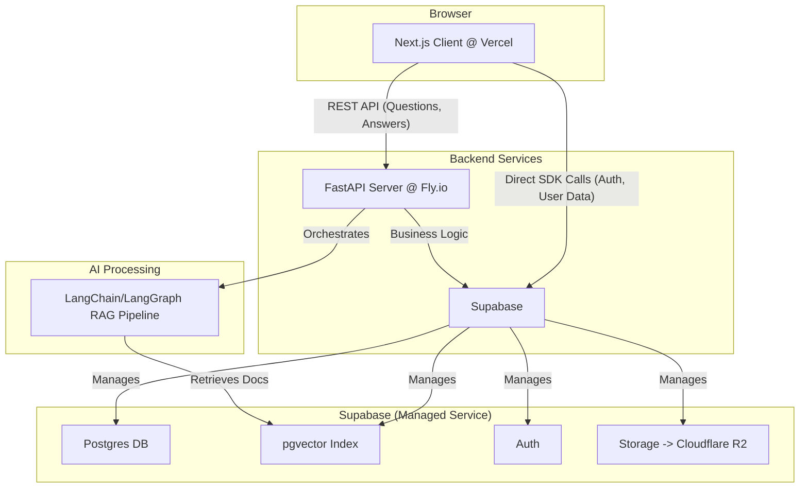

Here is the complete and final refined TRD, rewritten to be lean, focused, and free of over-engineering.

---

# **Technical Requirements Document (TRD): Hybrid Legal Q&A Platform**

This document outlines the technical specifications for the MVP of the real estate legal Q&A platform. The focus is on a minimal, robust, and scalable implementation aligned with the PRD.

## 1. System Overview

-   **Objective**: Build a web platform providing instant AI-generated legal answers from a controlled knowledge base, supplemented by paid answers from verified lawyers.
-   **Core Components**:
    1.  **Web Client**: A Next.js application for all user interactions.
    2.  **API Server**: A FastAPI backend handling business logic and AI orchestration.
    3.  **AI Engine**: A LangChain-based RAG (Retrieval-Augmented Generation) pipeline.
    4.  **Unified Backend**: Supabase for database (Postgres + pgvector), authentication, and file storage (interfacing with Cloudflare R2).
-   **Key Principles**:
    -   **Serverless First**: Utilize managed services (Vercel, Fly.io, Supabase) to minimize infrastructure management.
    -   **Simplicity**: Implement only the essential features for the MVP. Defer optimizations until performance data is available.
    -   **API-Driven**: The Next.js client is fully decoupled from the backend logic.

## 2. Core Architecture & Tech Stack

The architecture is designed for simplicity and rapid development.

### Technology Choices

-   **Frontend**: **Next.js** (App Router) with **Tailwind CSS**. For fast rendering (SSR) and efficient development.
-   **Backend**: **FastAPI (Python)**. Chosen for its performance and native integration with the AI/ML ecosystem (LangChain).
-   **Database**: **Supabase Postgres** with the **pgvector** extension. A single, managed solution for structured data, user auth, and vector embeddings.
-   **AI**: **LangChain/LangGraph**. To structure the RAG pipeline for document ingestion, retrieval, and generation.
-   **File Storage**: **Cloudflare R2** (via Supabase Storage). For cost-effective storage of legal PDFs and verification documents.
-   **Hosting**: **Vercel** for the Next.js frontend and **Fly.io** for the FastAPI backend container.

## 3. Data & Service Schemas (High-Level)

This defines the core data structures and API contracts.

### 3.1. Database Schema (Core Tables)

-   **`users`** (Managed by Supabase Auth)
    -   `id` (uuid, pk)
    -   `email` (text)
    -   `role` (enum: 'user', 'lawyer', 'admin')
    -   `lawyer_profile_id` (uuid, fk, nullable)

-   **`lawyer_profiles`**
    -   `id` (uuid, pk)
    -   `user_id` (uuid, fk)
    -   `name` (text)
    -   `verification_status` (enum: 'pending', 'approved', 'rejected')
    -   `verification_document_url` (text)
    -   `balance` (integer, default: 0) - *Represents credits, not currency.*

-   **`questions`**
    -   `id` (uuid, pk)
    -   `user_id` (uuid, fk)
    -   `title` (text)
    -   `body` (jsonb) - *Structured data from the input form.*
    -   `category` (text)
    -   `ai_answer` (jsonb) - *`{ "content": "...", "sources": [...] }`*
    -   `created_at` (timestamp)

-   **`answers`** (Lawyer Answers)
    -   `id` (uuid, pk)
    -   `question_id` (uuid, fk)
    -   `lawyer_id` (uuid, fk to `users`)
    -   `content` (text)
    -   `created_at` (timestamp)

-   **`documents`** (Legal PDFs for RAG)
    -   `id` (uuid, pk)
    -   `file_name` (text)
    -   `storage_url` (text)
    -   `version` (integer)
    -   `is_active` (boolean)
    -   `uploaded_by` (uuid, fk to `users`)

### 3.2. Key API Endpoints (FastAPI)

-   `POST /questions`: Submit a new question. Triggers the RAG pipeline.
-   `GET /questions/{id}`: Retrieve a question, its AI answer, and all lawyer answers.
-   `POST /questions/{id}/answers`: A verified lawyer submits an answer.
-   `POST /lawyers/verify`: A user with role 'lawyer' submits verification documents.
-   `POST /admin/documents`: An admin uploads a new PDF document. Triggers ingestion.
-   `PUT /admin/lawyers/{id}/approve`: An admin approves a lawyer's verification.

## 4. Key Technical Flows

### 4.1. AI Q&A Flow (RAG)

1.  **Admin Upload (Ingestion)**:
    -   Admin uploads a PDF via the admin panel.
    -   The file is saved to Cloudflare R2.
    -   A background job is triggered:
        -   The PDF is parsed and split into text chunks.
        -   Each chunk is converted into a vector embedding using an embedding model.
        -   Embeddings and their corresponding text are stored in the `pgvector` index.

2.  **User Asks (Generation)**:
    -   User submits a question via the Next.js client.
    -   The FastAPI `/questions` endpoint is called.
    -   The user's question is converted into a vector embedding.
    -   A similarity search is performed against the `pgvector` index to find the most relevant document chunks (context).
    -   The original question and the retrieved context are passed to a Large Language Model (LLM) via LangChain.
    -   The LLM generates an answer based *only* on the provided context, citing sources.
    -   The generated answer and sources are saved to the `questions` table and returned to the client.

### 4.2. Lawyer Authentication & Answering Flow

1.  **Sign-up & Verification**:
    -   A user signs up and selects the 'lawyer' role.
    -   They are prompted to upload verification documents (e.g., license PDF).
    -   The documents are saved to a secure R2 bucket.
    -   The `lawyer_profiles.verification_status` is set to `pending`.
2.  **Admin Approval**:
    -   An admin reviews the pending applications in the admin dashboard.
    -   The admin approves or rejects the application, updating the `verification_status`.
3.  **Answering**:
    -   An approved lawyer browses questions.
    -   They submit an answer via `POST /questions/{id}/answers`.
    -   The API backend verifies:
        -   The user is an approved lawyer.
        -   Their `balance` is ≥ 1000.
    -   A database transaction deducts 1000 from their `balance` and inserts the new answer into the `answers` table.

## 5. Implementation Sprints (MVP)

This roadmap directly translates the PRD timeline into technical deliverables.

-   **Sprint 1 (D+8 ~ D+22): AI Q&A Core**
    -   **Goal**: A user can ask a question and get an AI answer.
    -   **Deliverables**:
        -   Setup Supabase schema (users, questions, documents).
        -   Implement admin PDF upload and RAG ingestion pipeline.
        -   Build FastAPI endpoint for `/questions` that runs the RAG chain.
        -   Create a basic Next.js page to submit a question and display the AI answer.

-   **Sprint 2 (D+23 ~ D+37): Lawyer Functionality**
    -   **Goal**: Verified lawyers can provide paid answers.
    -   **Deliverables**:
        -   Implement lawyer verification flow (upload form, admin approval UI).
        -   Build lawyer answer submission UI and API (`/questions/{id}/answers`).
        -   Implement the credit deduction logic within a DB transaction.
        -   Integrate TossPayments for lawyers to charge their credit balance.
        -   Display lawyer answers in a thread below the AI answer.

-   **Sprint 3 (D+38 ~ D+52): Admin & Polish**
    -   **Goal**: Admins have necessary tools and the platform is ready for beta.
    -   **Deliverables**:
        -   Build admin dashboard for PDF version management and lawyer verification.
        -   Implement keyword auto-tagging (simple NLP on question title) and save as tags.
        -   Develop the "similar questions" component based on tag matching.
        -   Refine UI/UX and ensure all legal disclaimers are in place.

## 6. Non-Functional Requirements & Risks

-   **Performance**:
    -   **Target**: P95 AI answer generation time < 5 seconds.
    -   **Strategy**: Use streaming responses to show text as it's generated. Cache common queries if needed *after* launch.

-   **Security**:
    -   **Authentication**: Handled by Supabase Auth (JWT).
    -   **Authorization**: Use Supabase Row Level Security (RLS) policies extensively.
        -   Users can only edit their own questions.
        -   Only approved lawyers can post answers.
        -   Admins have access to all data.
    -   **Input Validation**: Use Pydantic in FastAPI to strictly validate all API inputs.

-   **Key Risks & Mitigations**:
    -   **AI Hallucination**: The RAG pipeline inherently reduces this risk.
        -   **Mitigation**: Strictly enforce source citation in the LLM prompt. Prominently display a "user report error" button on every AI answer.
    -   **Regulatory Compliance (변호사법)**: AI answers must not be presented as legal advice.
        -   **Mitigation**: Display a clear, non-negotiable legal disclaimer above every AI answer. Clearly label AI vs. Lawyer answers.
    -   **Slow Lawyer Adoption**: The platform is useless without lawyers.
        -   **Mitigation**: The system will support issuing free initial credits to new lawyers, managed by an admin. This is a business decision supported by the `balance` field.