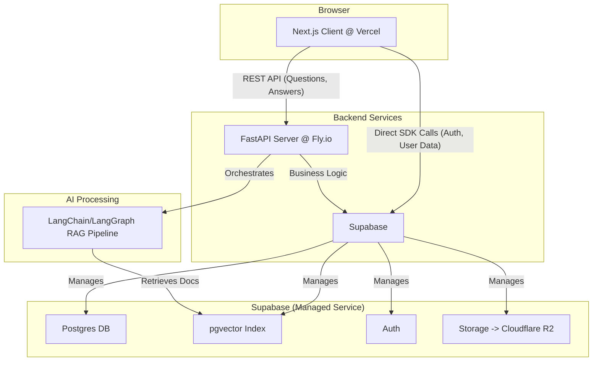

# Technical Requirements Document (TRD): Hybrid Legal Q&A Platform

이 문서는 MVP 범위를 기준으로 한 기술 명세입니다. PRD와 정렬되며, 단순하고 확장 가능한 구조를 채택합니다.

## 1. System Overview
- **Objective**: 법령 기반 RAG로 AI 즉시 답변 + 변호사 유료 추가답변을 제공하는 웹 플랫폼
- **Core Components**: Next.js(웹), FastAPI(API), Supabase(DB/Auth/Storage), LangChain(LangGraph) RAG
- **Principles**: Serverless-first, 단순성, API-Driven 분리

## 2. Architecture & Stack
- 프론트엔드: Next.js(App Router), Tailwind CSS, Vercel
- 백엔드: FastAPI(Python), Fly.io
- 데이터: Supabase Postgres + pgvector, Supabase Auth, Supabase Storage(Cloudflare R2 연동)
- AI: LangChain/LangGraph 기반 RAG 파이프라인

## 3. Data & API (High-Level)
### 3.1 Database (핵심 테이블)
- `users`(Supabase Auth), `lawyer_profiles`, `questions`, `answers`, `documents`
- `questions.ai_answer` JSON: `{ content: string, sources: string[] }`

### 3.2 API Endpoints (FastAPI)
- POST `/questions`: 질문 제출 → RAG 실행 → 답변/출처 저장
- GET `/questions/{id}`: 질문 + AI 답변 + 변호사 답변 조회
- POST `/questions/{id}/answers`: 변호사 답변 제출(승인·잔액 검증, 1,000 차감)
- POST `/lawyers/verify`: 변호사 인증 서류 제출
- POST `/admin/documents`: PDF 업로드 → 백그라운드 임베딩 파이프라인
- PUT `/admin/lawyers/{id}/approve`: 변호사 승인/거절

## 4. Key Flows
### 4.1 RAG Ingestion
- 관리자 PDF 업로드 → R2 저장 → 텍스트 청크 분할 → 임베딩 생성 → pgvector 저장

### 4.2 RAG Generation
- 사용자 질문 → 임베딩 → 유사도 검색 → 컨텍스트 기반 답변 생성(출처 포함) → 저장/반환

### 4.3 Lawyer Answering
- 승인 변호사만 가능, `balance >= 1000` 요구 → 트랜잭션 차감 + 답변 insert

## 5. Sprints (MVP)
- Sprint 1: RAG 핵심(Q&A), 스키마, `/questions`
- Sprint 2: 변호사 인증/답변/결제(충전), 잔액 차감 로직
- Sprint 3: 관리자 대시보드(PDF 관리), 태깅/유사 질문, UI 폴리시

## 6. Non-Functional
- 성능: P95 생성 < 5s, 스트리밍, 사후 캐시
- 보안: Supabase Auth, RLS, Pydantic 검증, 예외 핸들러
- 리스크: 환각(출처 강제), 규제(면책/구분), 변호사 유입(초기 크레딧)
